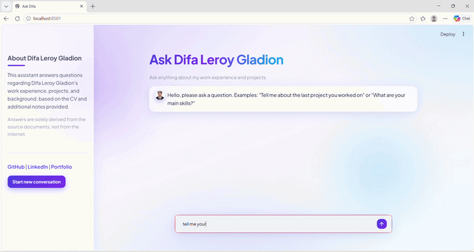
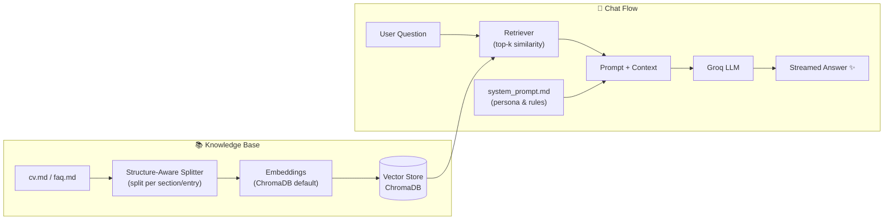

# 🤖 Ask Difa — Personal RAG Chatbot

[](https://streamlit.io/)
[](https://python.langchain.com/)
[](https://groq.com/)
[](https://www.trychroma.com/)
[](https://www.python.org/)

> An AI assistant that answers questions about **Difa Leroy Gladion** — work
> experience, projects, and background — powered by **Retrieval-Augmented
> Generation (RAG)**, so every answer is grounded in real source documents,
> not model hallucinations.

🎨 **Live Demo**: 


## ✨ Features

- 🧠 **Grounded answers** — responses come only from the provided CV & FAQ documents, never from the open internet
- ⚡ **Blazing fast inference** — powered by Groq's LPU inference engine
- 💬 **Streaming responses** — answers appear token-by-token in real time
- 🪟 **Glassmorphism UI** — frosted-glass chat bubbles, animated gradient title, floating aurora background & micro-animations
- 🔍 **Structure-aware chunking** — documents are split per section/entry, so context stays semantically complete

---

## 🏗️ Architecture



**How it works:**

1. **Ingestion** — Source documents (`cv.md`, `faq.md`) are split following their
   original heading and entry structure *(instead of character-count splitting)*,
   so one chunk always contains one complete work experience / project / Q&A.
2. **Embedding** — Chunks are embedded using ChromaDB's default embedding function
   (lightweight — no heavy dependencies like `sentence-transformers` needed).
3. **Retrieval** — For each question, the retriever fetches the **top-k** most
   relevant chunks from the vector store.
4. **Generation** — The retrieved context is injected into the prompt together with
   the persona rules from `system_prompt.md`, then streamed back through the Groq LLM.

---

## 🛠️ Tech Stack

| Layer | Technology | Purpose |
|-------|-----------|---------|
| 🖥️ **Interface** | [Streamlit](https://streamlit.io/) | Chat UI with custom glassmorphism CSS |
| 🔗 **Orchestration** | [LangChain](https://python.langchain.com/) | RAG chain (LCEL) |
| 🧠 **LLM** | [Groq](https://groq.com/) | Ultra-fast LLM inference |
| 🗄️ **Vector Store** | [ChromaDB](https://www.trychroma.com/) | Embeddings & similarity search |

---

## 🚀 Running Locally

**1.** Clone this repo and enter the folder

**2.** Install dependencies:
```bash
pip install -r requirements.txt
```

**3.** Create a `.env` file in the root folder:
```env
GROQ_API_KEY=your_key_here
```
> 🔑 Get your API key from [console.groq.com](https://console.groq.com/keys)

**4.** *(Optional)* Test the terminal version first — handy to check retrieval before using the UI:
```bash
python rag_chatbot.py
```

**5.** Run the Streamlit app:
```bash
streamlit run app.py
```

---

## ☁️ Deploying to Streamlit Cloud

1. Push the repo to GitHub
   > 💡 The `chroma_db/` folder is intentionally excluded via `.gitignore` —
   > the vector store is rebuilt automatically every time the app starts.
2. Create a new app at [share.streamlit.io](https://share.streamlit.io/), point it to `app.py`
3. In the **Secrets** menu, add:
   ```toml
   GROQ_API_KEY = "your_key_here"
   ```

---

## 📁 Project Structure

```
.
├── .streamlit/
│   └── config.toml        # 🎨 theme colors
├── assets/
│   ├── style.css          # 🪟 glassmorphism UI & animations
│   └── avatar.jpg         # 🤖 assistant avatar
├── knowledge_docs/
│   ├── cv.md              # 📄 work experience & projects
│   └── faq.md             # ❓ additional Q&A notes
├── app.py                 # 🖥️ Streamlit chat interface
├── rag_chatbot.py         # 🧠 RAG logic (loader, splitter, chain)
├── system_prompt.md       # 👤 persona instructions & answer rules
└── requirements.txt       # 📦 dependencies
```

---

<p align="center">
  Made with 💜 by <a href="https://github.com/Eoneine">Difa Leroy Gladion</a>
</p>
